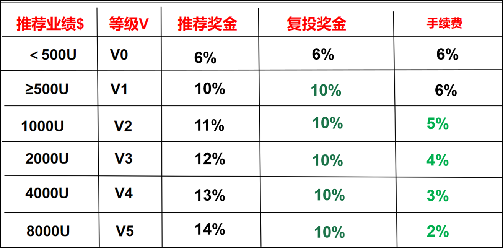
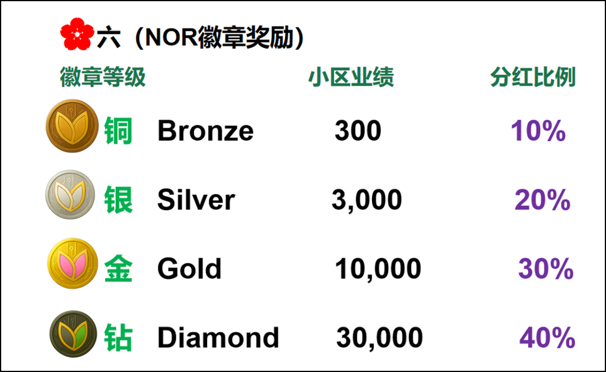

# NOR Protocol

NOR Protocol is a decentralized membership and incentive protocol designed to
build a sustainable economic cycle through structured membership levels,
transparent reward distribution, and continuous asset flow.

---

## Membership System Overview

The membership system defines clear participation levels and corresponding
rights and rewards.

---

## Bonus & Reward System

### Referral Bonus

Rewards are distributed based on direct referrals and participation level.

### Team Bonus

Team incentives encourage long-term collaboration and network growth.

---

## Asset Flow & Re-invest Mechanism

This diagram illustrates how assets circulate within the NOR ecosystem,
supporting sustainability and continuous growth.

---

## Economic Cycle Model

The economic cycle ensures that value flows between participants, the protocol,
and reinvestment mechanisms in a balanced and transparent way.

---

## Vision

NOR Protocol aims to create a fair, transparent, and long-term incentive system
that aligns individual participation with ecosystem-level growth.

