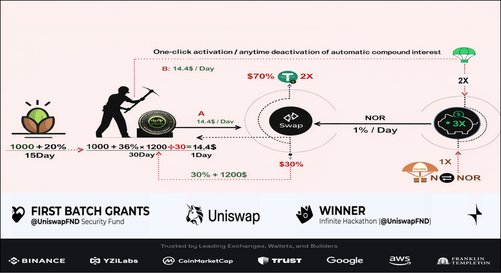

# NOR Protocol

## Membership System Overview

---

## Asset Flow & Re-invest Mechanism

- Mining rewards are automatically re-invested to the local node  
- Users can withdraw assets on-chain, or choose 100% re-invest  
- SWAP balance not used for trading  
  → NOR can automatically flow into the yield pool to continue minting  
  → This option can be enabled or disabled at any time  

---

## Minting to Yield Pool (3X Output)

- Minted NOR can be optionally deposited into the yield pool  
- Yield output after entering the pool:  
  **3X**

---

## Hold-to-Earn Maximization (3 × NOR)

- Users may choose the hold-to-earn strategy  
- Maximum benefit model:  
  **3 × NOR**

---

## Referral Rewards & Team Dividend

---

## NOR Economic Cycle (Re-invest Model)

> Terminology unified:  
> ❌ Compound Interest  
> ✅ **Re-invest (Minting Principal Reinforcement)**

---

## NOR Value Flywheel

